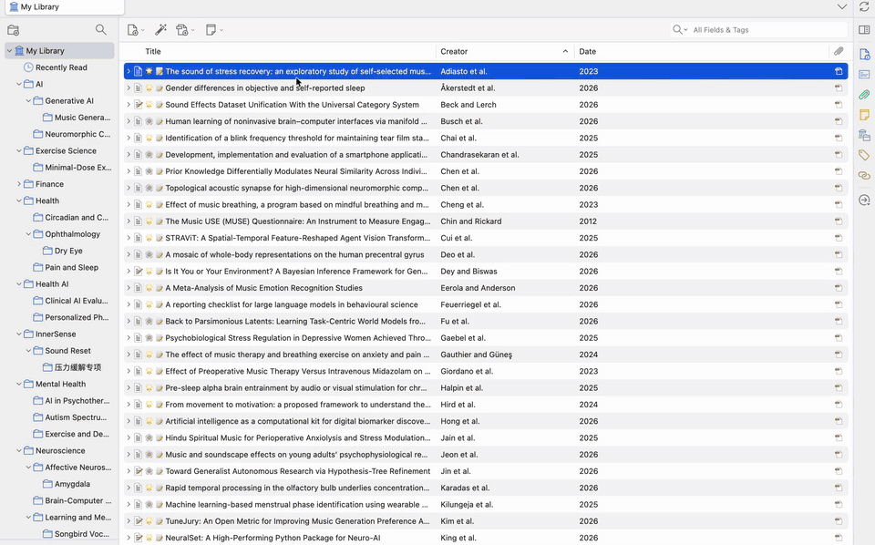

# Mktero

[English](./README.md) · **简体中文**

[](https://github.com/tenglvjun/mktero/actions/workflows/test.yml)
[](https://github.com/tenglvjun/mktero/releases/latest)
[](./LICENSE)
[](https://www.zotero.org/)

**在 Zotero 中以带来源链接的 Markdown 阅读 PDF。**

Mktero 是适用于 Zotero 7、8、9 和 10 的无需重启扩展。需要时，它会将本地 PDF
发送到所选的 OCR 服务（[MinerU](https://mineru.net/) 或
[Mistral OCR 4.1](https://docs.mistral.ai/models/ocr-4-1)）进行转换，再在临时的阅读优先
Zotero 标签页中打开 Markdown、公式、表格、图片、引用和标注。内容寻址的本地缓存会按 PDF 内容和解析配置复用转换结果，避免重复处理。

[下载最新版本](https://github.com/tenglvjun/mktero/releases/latest) ·
[产品介绍页](https://mktero.com/) ·
[文档](#文档) ·
[社区](#社区)

> [!IMPORTANT]
> Mktero 目前处于 Beta 阶段。缓存未命中时，完整 PDF 会发送到所选的转换服务，因此需要
> 配置 MinerU API Token 或 Mistral API Key。可选的 AI 翻译会把受保护的 Markdown 批次发送给你配置的 Provider。
> 处理敏感文档前，请阅读[数据与隐私](./docs/privacy.zh-CN.md)。



## 目录

- [核心能力](#核心能力)
- [快速开始](#快速开始)
- [文档](#文档)
- [数据与隐私](#数据与隐私)
- [开发](#开发)
- [社区](#社区)
- [贡献](#贡献)
- [License](#license)

## 核心能力

### 阅读

- 将 OCR 结果、双栏正文、公式、表格、图片、列表和代码重排成连续的论文阅读文档。
- 隐藏出版商刊头、首页版权声明、重复页眉页脚和页码，并保留可靠的页码与区域映射，使正文、公式、表格和图片可以跳回 PDF 来源。映射唯一时，PDF 中选中的文字也可以打开对应的 Markdown 段落。
- 通过目录或图表索引浏览文档，预览引用、作者单位、图片和表格，并用 `Cmd/Ctrl+F` 查找正文。
- 只在版面证据、页面坐标和 Markdown 范围一致时，从本地 PDF 恢复图组。恢复在后台 Worker 中进行并就地替换占位，慢的图不会阻塞阅读。

### 标注、校对和翻译

- 在 Markdown 中显示 Zotero PDF 高亮和下划线，并支持新建、编辑、改色、评论和删除标注。
- 在不修改不可变 OCR 结果的前提下，校对已有段落、标题和 GFM 表格单元格。
- 通过配置的 Vercel AI SDK Provider 翻译整篇文章，并在原文、译文和连续块级双语阅读之间切换；也可按需查询选中的术语或段落。

### 文库与导出

- 在 Markdown 引用弹窗中检查文献是否存在于可访问的 Zotero 文库，复制其他文库中的文献，并导入缺失的元数据和公开 PDF。
- 只在当前 Zotero 文库内展示可匹配的直接引用关系，并在支持时使用 Semantic Scholar、OpenCitations 和 OpenAlex 刷新数据。
- 保存便携 Zotero 快照，或将修正后的原文 Markdown 和提取图片导出到本地文件夹或 Obsidian 库。也可以把已经转换好的 Markdown 批量写入 Obsidian 库。
- 在文献列表中显示 Markdown 列。只有这台电脑、当前转换设置下仍有可阅读的缓存时才会点亮。排队或转换期间，这一列会显示仅在本次会话有效的加载动画。完成标记保存在 Zotero 配置文件中，不修改条目，也不会同步。

界面跟随 Zotero 的英文或简体中文显示语言，其他语言回退为英文。

## 快速开始

> [!TIP]
> 安装 XPI，打开 `设置 -> Mktero`，填入 OCR 密钥，然后打开 PDF，点击阅读器工具栏的 Mktero 图标。

### 使用要求

- **Zotero。** 桌面版 `7.0` 至 `10.0.*`。
- **PDF。** 已下载并可在本机访问的附件。
- **OCR。** MinerU 云端或 [Mistral](https://console.mistral.ai/api-keys/) 需要 API key。MinerU 也可以改用自部署的 MinerU 4.0 服务，此时 API key 可选。
- **网络。** 能够访问所选转换 API，或能够访问配置的本地 MinerU 服务。

文件大小、页数、账户额度和服务可用性由各服务控制，请以
[MinerU API 文档](https://mineru.net/apiManage/docs)或
[Mistral OCR 文档](https://docs.mistral.ai/studio/document-processing/basic_ocr)中的当前限制为准。

### 安装

1. 从 [GitHub Releases](https://github.com/tenglvjun/mktero/releases/latest)
   下载最新的 `mktero-<version>.xpi`。
2. 在 Zotero 中打开 `工具 -> 插件`。
3. 打开齿轮菜单，选择 `Install Add-on From File...`。
4. 选择 XPI 文件并按 Zotero 提示完成安装。

正式 GitHub Release 可以通过 Zotero 自动更新；草稿和预发布版本不会成为自动更新目标。

### 配置

安装后打开 `设置 -> Mktero`，选择转换服务并填写对应的 API key。AI 功能和阅读选项都是可选的，每个 AI 厂商各自保存模型、密钥和相关设置。凭据会作为普通的未加密首选项存储在当前的 Zotero 配置文件中。

所有设置项见[配置](./docs/configuration.zh-CN.md)，发送与存储位置见[数据与隐私](./docs/privacy.zh-CN.md)。

### 打开 PDF

1. 从已经打开的 PDF 或文库条目开始：

   - 在 Zotero 中打开 PDF，点击阅读器工具栏的 Mktero 文件图标。
   - 右键 PDF 或文库条目，选择 `使用 Mktero 阅读 Markdown`。
   - 选中多条后选择 `准备所选 Markdown`，会开始解析，不为每篇打开标签页。
   - 右键分类并选择 `准备此分类的 Markdown`，只会解析该分类自己的 PDF，不包括子分类。只有右键单篇时才是 `使用 Mktero 阅读 Markdown`。

2. 在临时 Mktero 标签页中查看上传、转换和下载进度。存在有效缓存时会跳过远程转换。批量准备使用 Zotero 的进度窗口，最小化后会继续。
3. 使用目录、查找、引用、图表预览、来源链接和 Zotero 笔记面板浏览文档。

> [!NOTE]
> Mktero 标签页是会话级的，Zotero 重启后不会恢复。关闭标签页不会取消进行中的转换，转换会在后台继续，并出现在准备进度窗口中。关闭扩展时，进行中的转换和翻译请求会被取消。批量中每篇未命中缓存的 PDF 会按单篇转换的相同方式发送。再次打开同一 PDF 和同一转换配置时，会回到上次阅读的段落。

## 文档

| 文档 | 内容 |
| --- | --- |
| [配置](./docs/configuration.zh-CN.md) | 所有设置项及默认值 |
| [阅读与标注工作流](./docs/workflows.zh-CN.md) | 校对、标注、AI 翻译、引用、文献导入、快照和导出 |
| [图组恢复流程](./docs/figure-pipeline.zh-CN.md) | 如何从本地 PDF 重建图组 |
| [数据与隐私](./docs/privacy.zh-CN.md) | Mktero 发送了哪些数据、存储在哪里 |
| [当前限制](./docs/limitations.zh-CN.md) | 支持的 PDF、导航方式和资源上限 |
| [开发](./docs/development.zh-CN.md) | 构建、测试、图组回归语料和贡献流程 |

## 数据与隐私

- 缓存未命中时，完整 PDF 会发送到所选的 MinerU 云端、配置的本地 MinerU 服务或 Mistral 服务。
- 凭据、缓存的 Markdown 和图片、校对、译文和阅读位置会以未加密形式存储在当前 Zotero 配置文件中，Mktero 不会同步这些数据。
- 可选的 Mktero 账号登录只会在点击登录时发送邮箱和密码。注册会另外向邮箱发送验证码。访问令牌和刷新令牌同样只保存在当前配置文件中。账号面板打开时，扩展会使用该令牌向你选择的服务请求账号资料和转换活跃度计数，并以账号卡片上的统计展示。
- 引用、文献和翻译请求都是受限且本地优先的；日志不会包含 API Token、预签名地址、PDF 字节或带认证的响应。

完整说明和数据表见[数据与隐私](./docs/privacy.zh-CN.md)。

## 开发

使用 [`.node-version`](./.node-version) 指定的 Node.js 版本，目前为 `24.15.0`。Node.js 25 不在支持范围内。

```bash
npm ci
npm run check
npm test
npm run build
```

图组回归语料见[开发](./docs/development.zh-CN.md)。

## 社区

使用问题可以进 QQ 群、微信，或加入 [Discord](https://discord.gg/uyxmxah2sh)。功能想法、阅读工作流和 Beta 反馈请前往
[GitHub Discussions](https://github.com/tenglvjun/mktero/discussions)。确认且可复现的问题请提交到
[GitHub Issues](https://github.com/tenglvjun/mktero/issues)。

请勿在 QQ 群、微信、Discord、Issue 或 Pull Request 中发送 API Key、PDF 原文或带凭据的日志。

QQ 是用户群：可以扫码，也可以在 QQ 中搜索群号 `616518076`。

<table>
  <tr>
    <td align="center" width="220">
      <br>
      <b>QQ</b>
    </td>
    <td align="center" width="220">
      <br>
      <b>微信</b>
    </td>
  </tr>
</table>

## 贡献

欢迎提交 Pull Request。修改运行时行为时，请运行上面的完整验证命令，并为受影响的行为补充测试。

- 功能想法、阅读工作流和 Beta 反馈：[GitHub Discussions](https://github.com/tenglvjun/mktero/discussions)
- 使用问题：[社区](#社区)
- 确认且可复现的问题：[GitHub Issues](https://github.com/tenglvjun/mktero/issues)

请勿在 QQ 群、微信、Discord、Issue、Pull Request 或日志中提交凭据、私密 PDF 或其他敏感信息。

## License

[MIT](./LICENSE) © 2026 Tony
