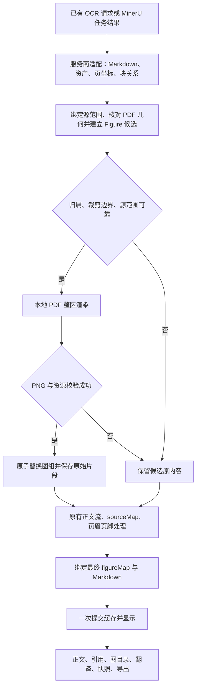

# 完整 Figure 恢复设计

**日期：** 2026-09-11

**代码基线：** `663733a`（Mktero 0.3.9）

**主开发计划：** [一次性实施计划](../plans/2026-09-11-figure-region-restoration.md)

**交付范围：** 将已同意的第一步缺陷修复、第二步公共图组模型、第三步 PDF 整图区裁剪作为同一项功能完成，并覆盖缓存、修订、翻译、引用、快照和导出。

## 1. 最终行为与边界

一张论文 Figure 是一个语义对象，可以包含多个图片裁片、PDF 矢量内容、子图标签、坐标轴文字、图例和一个公共图注。程序先确定这些内容的归属，再重排正文。

- 对归属和边界均可靠的图组，从本地 PDF 渲染完整图区，生成普通本地 PNG；2×2、4×4、留空单元、跨行和不规则排列都保持原貌。
- 图片之间出现 OCR 文字不打断同一图组。文字只有在成功生成的 PNG 中得到覆盖，并且能精确定位到原 Markdown 范围时，才从正文流移除。
- 图注位于裁图之外，保持可选择、可搜索和可翻译；图注只显示一次。
- 正文、图目录和 Figure 引用预览使用同一图组身份和同一完整图片。对 `Figure 2b`，有唯一子图标签与坐标时保留子图来源；无法唯一定位时延续已有的父图回退规则。
- 成功转换的可读 Markdown 是固定快照。图片恢复在首次转换的缓存提交之前完成，滚动、预览和缩放不再改写 Markdown 或源偏移。
- 裁图失败、坐标不可信、图组归属不明确、资源不足时，保留该图组原来的图片、文字和图注，并允许沿已有来源映射查看原 PDF。失败只影响当前候选图组。
- 保留被替换的原始图片资产和 OCR 源片段，供追溯、缓存与快照恢复；它们不再次进入正文、正文翻译或正文检索。
- 普通语义表格继续走表格流程。不能把 `table`、正文公式或代码块仅因位置接近就吸收到 Figure 中。
- 本次自动合成限定为同一物理 PDF 页。跨页续图保留逐页内容；不跨页计算一个包围框，也不从相同 Figure 编号推导跨页合并。
- 本地恢复不增加 OCR/VLM 服务调用。缺少足够版面证据时不按图片数量宣称恢复了原布局。

## 2. 已验证的问题

上一轮诊断使用 Node.js 24.15.0 和合成 OCR 结果，未读取用户的具体 PDF。现有四组相关测试共 121 项通过，但组合案例暴露了以下缺陷：

| 案例 | 当前实际结果 | 本功能的要求 |
| --- | --- | --- |
| 干净 2×2 | 两个服务均能识别四张子图 | 保持完整 |
| 第一张后插入图内 OCR 文字 | Figure 只关联后面三张 | 四张及所属文字仍归同一对象 |
| Mistral 删除上述文字 | 遗留空行仍导致断组 | 合法图组不被空行数拆开 |
| 两张子图含相同轴标签 | 唯一字符串匹配无法移除重复文字 | 依据块身份和源范围定位，正文同词不受影响 |
| 左高图＋右侧上下两图 | 被表达为三张竖排 | 保留原始位置、比例和跨行关系 |
| 最后一张在左下或右下 | 两种输入生成相同布局 Markdown/HTML | 两种布局必须可区分 |
| 16 张图片缺坐标 | Mistral 推测为三列 | 不把推测列数当作原图结构 |
| 窄窗口 | CSS 改成两列或一列 | 整图等比缩放，放大查看 |

主要位置：`src/markdown/figure-layout-normalizer.js`、`src/markdown/markdown-figures.js`、`src/mistral/mistral-result.js`、`src/mineru/figure-panel-normalizer.js`、`ui/markdown.css`。

另核对了 MinerU 的[公开 VLM 输出实现](https://github.com/opendatalab/MinerU/blob/4fe4bde114a23ee5dd637eae99b767f4669bf58c/mineru/backend/vlm/vlm_middle_json_mkcontent.py)：`content_list` 的 `bbox` 来自父 `para_block`；父块的 `blocks` 能区分 `image_body`、`image_caption` 等。一个扁平 `img_path` 也不能完整表达父块中的所有图片 span。因此必须区分父图范围、图片本体范围和图注范围。该源码说明格式的表达能力，不保证云 API 每个结果包都包含详细布局文件。

## 3. 固定技术约束

下面这些行也是主计划的全局约束，执行时逐字适用：

- 使用 `.node-version` 指定的 Node.js 24.15.0；禁止使用 Node.js 25。
- 运行时代码使用 JavaScript ES modules、显式 `.js` 导入、四空格缩进、单引号、分号和命名导出。
- esbuild 输出 Firefox 115 兼容包；支持 Zotero 7、8、9、10。
- `src/bootstrap.js` 保持组合根；纯图组算法不得导入 Zotero、DOM、IOUtils 或 Node.js API。
- 不新增生产依赖；复用现有 PDF.js、fflate、Markdown parser 和测试工具。
- 保留所有生命周期入口、一 PDF 一活动标签页、转换取消和 Zotero 9 工具栏清理兼容逻辑。
- 保留只读阅读状态以及现有受控纠错流程，不增加图片编辑或手动重排工作流。
- 新增用户可见文字进入 `src/i18n/localization.js`，英文和简体中文同步；HTML 节点使用 XHTML 命名空间。
- 不加载远程 Markdown 图片；生成 PNG 只通过受控的本地资产解析器显示。
- API token、上传 URL、PDF 内容、原始认证响应和 OCR 文字不得出现在日志中。
- 缓存错误不使成功转换失败；保持原子替换、串行操作、过期和总量限制。
- 新源码加入 `npm run check`；新非导入运行时资产加入 `scripts/build.mjs`；不手改 `build/` 或 `node_modules/`。
- 实现交付前运行相关窄测试、`npm run check`、`npm test`、`npm run build`，并完成 Zotero 实际 PDF 验证。
- README.md 与 README.zh-CN.md 同步说明行为、限制、存储与隐私变化。

## 4. 处理顺序与模块边界



服务商适配先完成资产安全处理、换行归一化和必要的表格引用展开，尚不删除图内文字或执行图组重排。公共恢复服务接收这些结果和本次转换已经读到的 PDF 字节。成功图组先变成一个不可拆的普通 Markdown 图片块，再运行原有正文处理，避免图内文字参与跨栏、跨页续句判断。

`prepareMinerUResult()` 继续承担 MinerU 正文与 sourceMap 处理，接收恢复后的 `contentList`。Mistral 将当前大函数拆为 `decodeMistralResult()` 和 `prepareMistralResult()`；原 `normalizeMistralResult()` 保留为纯适配兼容入口，但没有 PDF 渲染器时不能执行不可恢复的图内文字删除。转换服务的正式路径是 decode → restore → prepare → finalizeFigureMap → cache。

已经带有效 `figureMap.version === 1` 且与 Markdown/资产一致的缓存或修订结果不重复恢复。MinerU extractor 当前会再次调用 `prepareMinerUResult()`，此入口必须对已完成结果幂等。

## 5. 数据契约

所有偏移为 JavaScript 字符串的 UTF-16 半开区间 `[from, to)`。页码为从 0 开始的物理 PDF 页序号。坐标统一为页面左上角原点、0–1000，但必须同时携带坐标所对应的页面框和旋转信息，不能只存四个数字。

### 5.1 服务商输入：FigureInput

```js
{
    provider: 'mineru', // 或 'mistral'
    markdown: '',
    assets: [], // 现有 { path, mimeType, data: Uint8Array }
    assetBasePath: '',
    pages: [{
        pageIndex: 0,
        width: 612,
        height: 792,
        unit: 'pt', // pt / px；px 的 dpi 未提供时为 null
        dpi: null,
        markdownRange: null, // 有确切页拼接范围时为 { from, to }
        coordinateFrame: 'display-cropbox',
        rotation: 0,
        geometryEvidence: 'provider-page-size',
    }],
    blocks: [{
        id: 'mineru:p0:b4:body0',
        sourceOrdinal: 4, // 适配时保存的原块序号，不随排序重算
        pageIndex: 0,
        type: 'image',
        role: 'panel',
        bbox: [100, 100, 450, 400],
        bboxKind: 'visual-body',
        assetPath: 'images/panel-a.png',
        parentId: 'mineru:p0:b4',
        text: '',
        sourceRanges: [{ from: 12, to: 42 }],
        rangeEvidence: 'unique-asset',
    }],
    contentList: [], // 与现有 provider sourceMap 兼容的块
    providerState: {}, // 仅含 pageOrder/chromeHints 等白名单信息，不保留第二份 Markdown
}
```

`bbox`、页面几何和 `sourceRanges` 允许缺失；缺失必须降低自动处理能力。`bboxKind` 只允许 `visual-body`、`caption`、`text`、`group`、`unknown`。`role` 只允许 `panel`、`caption`、`figure-text`、`body`、`unknown`。适配器只依据验证过的字段设置 role/parentId；不能把服务商未知字段原样透传。

`sourceRanges` 属于 block，始终对应当前 FigureInput.markdown。页的 markdownRange 只在原始页拼接边界可证明时填写；MinerU 无显式页文本范围时使用已绑定资产的页锚点窗口，不把整份 Markdown 当作每一页。sourceOrdinal 在适配时按原输出固定；parentId 只能引用同页验证过的父图块。Mistral 每页产生范围后按真实拼接偏移平移。MinerU 详细布局的点坐标按所属 `page_size` 归一化，扁平列表的 bbox 已经是 0–1000，不再次缩放。

### 5.2 转换中间对象：FigureCandidate

```js
{
    id: 'fig-p0-b4',
    pageIndex: 0,
    label: 'Figure 1.', // 无编号时为 null，不发明编号
    captionBlockIds: ['mineru:p0:b4:caption0'],
    panelBlockIds: ['mineru:p0:b4:body0', 'mineru:p0:b4:body1'],
    ownedTextBlockIds: ['mineru:p0:b4:axis0'],
    visualBBox: [100, 100, 900, 850],
    captionBBox: [100, 870, 900, 950],
    evidence: ['explicit-parent', 'separate-caption', 'exact-source-ranges'],
    decision: 'compose', // 或 'preserve'
    reason: null, // preserve 时为下文的稳定原因码
}
```

ID 来自页序号和锚点原块序号，同一输入稳定，不随图注翻译或正文纠错变化；服务商与解析版本由所在文档身份区分。无图注、但明确为同一父图的对象以第一个成员为锚点。图注未知时不能据此生成 Figure 编号或引用匹配。

### 5.3 持久化对象：figureMap

```js
{
    version: 1,
    pipeline: 'figure-region-v1',
    markdownHash: 'a'.repeat(64), // 示例；实际对最终 Markdown UTF-8 字节计算
    figures: [{
        id: 'fig-p0-b4',
        label: 'Figure 1.',
        pageIndex: 0,
        visualBBox: [100, 100, 900, 850],
        captionBBox: [100, 870, 900, 950],
        memberBlockIds: ['mineru:p0:b4:body0', 'mineru:p0:b4:body1'],
        panels: [{
            blockId: 'mineru:p0:b4:body0',
            label: 'a', // 未证实的子图标签为 null
            bbox: [100, 100, 450, 400],
            originalAssetPath: 'images/panel-a.png',
        }],
        render: {
            mode: 'pdf-region',
            assetPath: 'generated/figures/fig-p0-b4-0123456789abcdef.png',
            width: 1600,
            height: 1500,
            range: { from: 40, to: 160 },
            captionRanges: [{ from: 42, to: 87 }],
        },
        provenance: {
            coordinateFrame: 'display-cropbox',
            rotation: 0,
            evidence: ['explicit-parent', 'separate-caption'],
            fragments: [{
                blockId: 'mineru:p0:b4:axis0',
                role: 'figure-text',
                bbox: [150, 200, 350, 230],
                markdown: 'Time since treatment (days)',
            }],
        },
    }],
    preserved: [{ id: 'fig-p1-b2', pageIndex: 1, reason: 'ambiguous-caption' }],
}
```

图组原始图片、图注和图内文字的所有被消费片段均进入 `fragments`，按原源顺序保存。示例只展示一个片段。这里的原文不作为当前 Markdown 偏移使用。`render.range` 和 `captionRanges` 只对应最终可读 Markdown；进入缓存时 hash 必须匹配。

`figureMap.figures` 只存已完成的合成对象。`preserved` 只存有界的诊断摘要，不包含自动隐藏范围。无元数据的旧文档继续可读。

### 5.4 阅读视图：FigureView

```js
{
    id: 'fig-p0-b4:original',
    sourceId: 'fig-p0-b4',
    viewKind: 'original', // original / translation / comparison
    from: 40,
    to: 160,
    label: 'Figure 1.',
    caption: { label: 'Figure 1.', text: 'Figure 1. Treatment response.' },
    source: '',
    assetPath: 'generated/figures/figure.png',
    imageRange: { from: 40, to: 160 },
    translatedCaption: null, // comparison 可为 { from, to, text }
    panels: [], // 从 map 带入已证实的 label/bbox/blockId，legacy 可为空
    location: { pageIndex: 0, bbox: [100, 100, 900, 850] },
}
```

视图对象从实际当前 Markdown 生成。原文、译文、双语三个阅读模式各有自己的 view ID，共用 sourceId。沿用现有双语行为：完整图片只显示一次，原文和译文图注各显示一次；comparison 仅产生一个 FigureView，imageRange 指向实际图片节点，translatedCaption 指向实际译文图注，from/to 覆盖整个图组。source 是这个当前视图区间的安全 Markdown 预览源。翻译回退为原文时不重复图注。不能把原文偏移直接用到译文。

## 6. 图组归属与源范围算法

### 6.1 证据优先级

1. **明确父子关系。** MinerU 详细布局中验证过的 image/chart 父块、body、caption 和文本子块。父块 bbox 不自动充当图片本体 bbox。
2. **同页几何与唯一图注。** 使用图片本体框形成邻接分量，再与图注匹配；允许矩阵、缺角、跨行、不同尺寸和不规则排列，不预设行列数。
3. **Markdown 邻近关系。** 只协助定位源片段和生成待判断候选，不能单独授权删文或裁图。纯 Markdown 的旧布局标记保留兼容读取。

panel.label 只采纳服务商明确字段或能唯一对应一个 panel 的独立 a/b 等子图标签；同组重复、远离子图或无法区分轴文字时置为 null。服务商支持并实际提供父子字段时采用第一类证据；Mistral 当前 blocks/images 没有已验证的父组字段时，不虚构 parentId。

### 6.2 几何候选的确定规则

同一页内，对非嵌套图片建立邻接边：在 x 或 y 方向投影重叠不少于较短投影的 35%，另一方向的非负间距不大于 `min(180, max(24, 0.6 * min(widthA, heightA, widthB, heightB)))`。坐标单位为页面的 1/1000。包含关系中的父框先标为 group，不作为另一张子图重复计数。

图注与一个候选分量关联必须同时满足：

- 图注编号唯一，或有明确的父块关联；前后出现独立 Figure 编号构成硬边界。
- 图注位于分量上方或下方，水平投影重叠不少于较短投影的 50%；间距不超过 `min(120, max(40, 0.15 * groupHeight))`。
- 不跨物理页面；不穿越独立标题、表格、正文公式、代码或其他已确认图组。
- 没有第二个满足这些条件的图注候选；没有成员同时归属于两个候选图组。

这些是版本化的保守初始阈值，不是经过统计校准的置信度概率。修改阈值必须更新 pipeline 版本并重新运行完整样例集。

### 6.3 图内文字与正文

- 明确的 figure 子文本块可作为 ownedText 候选。
- 至少 90% 面积落在一个可靠图片本体框内的文字可作为候选；类型明确为 caption/table/code/heading 的块必须先遵守其角色，不能被此规则覆盖。
- 位于子图间隙的文本只有在图组和图注已经唯一确定后才参与判断：bbox 必须完全位于子图包围区，最多两行且不超过 120 Unicode 字符，并具有子图标签、单位/刻度、图例条目或短轴说明的形态。相邻的普通长段落、完整正文块或未知文本构成阻挡，不能仅凭落在包围框里就删除。
- 没有明确角色、也没有上述联合证据的文本保持 unknown。它若与拟裁图区冲突，则整个候选 preserve；不是把它暂时当正文删掉。
- 最终 visualBBox 包含所有图片本体和已确认 ownedText 的完整框。只有 bbox 完全被最终裁图区覆盖的文字才允许移出正文。
- 保留原始片段的资源预算不足时，也必须 preserve，不能先删除再丢弃追溯信息。

### 6.4 重复文字与位置绑定

`bindFigureSourceRanges(input)` 使用 Markdown AST 的真实节点边界，按以下顺序绑定：

1. 验证服务商提供的显式范围（若格式确有该字段），确认切片文字/图片路径匹配且在页面范围内。
2. 匹配同页唯一的本地资产路径；重复资产路径不能直接取第一次出现。
3. 使用两侧已经绑定的图片或标题作为锚点，在锚点之间匹配文字块。重复标签只在该窗口内存在唯一的、保持顺序的完整匹配时绑定。
4. 块和 Markdown 行的断行不同，可进行规范化比对，但必须保留规范化字符到原始 UTF-16 偏移的映射。
5. 多解、缺字、混合了图外正文的段落或超出匹配预算时，相关候选 preserve。绝不调用按全文字符串替换的删除操作。

同一窗口里两个 `Accuracy` 可绑定为两个有各自坐标的实例；图外正文里的 `Accuracy` 不加入消费范围。文字绑定不能依靠 O(n²) 全文尝试；每页使用锚点窗口和索引，总候选匹配次数有硬上限。

## 7. 服务商适配

### MinerU

在现有 `full.md`、稳定 `content_list.json` 和图片之外，可选读取同一逻辑结果根目录内唯一的 `middle.json` 或 `<name>_middle.json`。只接受 `pdf_info[]` 页对象及经过白名单验证的 `page_idx`、`page_size`、`para_blocks`、`blocks`、`lines`、`spans`、`type`、`bbox`、`image_path` 和文本内容字段。

详细布局用于保存每个 body/span 的位置、图注位置和父块关系，不能只保留父块的第一个 img_path。图片路径必须与已抽出的资产一一核对。没有 detailed JSON、格式不支持、文件过大或结构冲突时降级到稳定列表；可选文件不使整个成功结果失败。多个候选 detailed JSON 不任取一个，而是忽略详细布局并记录有界原因码。

不得把 `content_list_v2` 当作已有稳定格式直接读取，也不假定其中包含子块坐标。其支持不属于本次必需接口。

### Mistral

保留现有请求选项 `include_blocks: true` 和 `include_image_base64: true`。先规范化 `pages[].blocks` 与 `images` 的坐标和图片身份；block 与 image 元数据几何一致时合并，冲突时不选一个“看起来合理”的值。

拆分现有解析函数，保留全部图内文字候选记录。prepare 只消费当前 input.markdown、blocks、contentList，不从旧 pages[].markdown 重新生成文字；providerState 只保留 pageOrder、已验证 chromeHints 等旁证。取消“在 sourceMap 构造前先丢掉 interiorTextRecords”的行为；是否消费这些记录由公共恢复事务决定。已有页眉页脚保留与 `chromeRanges` 语义继续生效。

Mistral 新结果不再按 4 张→2 列、其他数量→最多 3 列推测原布局。旧文档中的布局标记仍能显示；自动恢复的新图组使用已生成的单张完整 PNG。

## 8. 本地 PDF 区域渲染

新增独立的 `createPDFFigureRegionRenderer()`，复用现有 PDF.js bootstrap 环境、打包 worker、CMap、字体和 WASM 资产；不把现有整页缩略图接口改成另一个含义。

```js
const renderer = createPDFFigureRegionRenderer({
    loadDocument,
    createCanvas,
    encodePNG,
    workerSrc,
    cMapUrl,
    standardFontDataUrl,
    wasmUrl,
});
const session = await renderer.open(fileData, { signal, ownerDocument });
const geometry = await session.getPageGeometry(0, { signal });
// geometry: { pageIndex, width, height, rotation, userUnit,
//     coordinateFrame: 'display-cropbox', viewBox, mediaBox, viewportTransform }
const crop = await session.renderRegion({
    pageIndex: 0,
    bbox: [100, 100, 900, 850],
    coordinateFrame: 'display-cropbox',
    rotation: 0,
    dpi: 192,
}, { signal });
// crop: { data: Uint8Array, mimeType: 'image/png', width, height }
await session.close();
await renderer.disposeAll();
```

坐标框允许 `display-cropbox`、`unrotated-cropbox`、`unrotated-mediabox`、`unknown`。getPageGeometry 的 width/height 是 scale=1、计入 userUnit 和页面旋转的可见 viewport 尺寸；viewBox 是 PDF.js page.view 的有效可见框，不能假称它是原始 MediaBox。mediaBox 默认为 null，只有加载适配器有独立可信数据时填写。需要 MediaBox 变换但没有该证据时 preserve；本次不新增手写 PDF 字典解析器，也不使用 PDF.js 私有字段。

服务商适配器必须根据已核验的输出版本声明 frame，未知版本不能凭页尺寸猜测。已验证为显示坐标的输入可使用本地页面旋转；无法证明方向的输入保持 unknown，特别不能靠相同长宽比判断 180 度或方形页面方向。比较尺寸时先区分单位：pt 可直接换算，px 且有 dpi 时换算到 pt，px 无 dpi 时只能核对纵横比；frame/方向仍需独立证据。可比的维度或纵横比冲突超过 1% 时不裁剪。非零可见框偏移及 0/90/180/270 度旋转均通过 viewport 变换验证，不能重复应用旋转。

服务在判断几何邻接之前调用纯函数 `alignFigureInputToPDF(input, pageGeometryByIndex)`，将已知 frame 的框统一到显示页坐标；未知/冲突页保留原因，不参与 compose。输入块保留 sourceBBox，页保留 sourceGeometry；无法对齐的页设置 geometryReason（稳定 preserve 原因码），该页的块不参与 compose；最终 visualBBox、captionBBox、panels 和 sourceMap 全部使用显示页的 0–1000 坐标。变换用 PDF.js scale=1 viewportTransform 的六个有限数值，先从输入框转到 PDF 用户空间，再转显示坐标；不能直接拿 unrotated bbox 做来源跳转。原几何和变换进入有界 provenance。

只生成裁图区大小的 canvas，并通过渲染 transform 平移、裁切 PDF 页面内容。不要先构造任意大整页高分辨率 canvas 再裁。图形、矢量线、文字使用 PDF 页面渲染结果，不能从 PDF 的嵌入位图列表代替整区渲染。

默认 192 DPI，白色背景，PNG 无损编码。以像素和边长预算约束最终 scale；resolver 将坐标边界外扩 2 个归一化单位，遇到图注/正文边界则收紧；renderer 接收最终框，不再次外扩。外扩后仍不得进入图外正文或图注。无法把图注与图区可靠分开时 preserve，不能默认整页截图替换 Figure。

传给 PDF.js worker 的字节使用有界副本，防止 transferable buffer 分离后破坏转换、hash 或重试所持有的原 fileData。全局至多一个正在执行的 figure render；同一转换共享 PDF session 和 page 对象，最后使用后释放。不复用 Zotero 阅读器当前缩放的 canvas。AbortSignal 取消排队、PDF load、render、编码和提交；取消必须向上传递，不能被当作单图失败吞掉。

## 9. 图组替换事务与源映射

核心规则为 `规划 → 渲染 → 校验 → 一次性提交`：

1. 收集每个成员的精确非重叠源范围，以及保留这些片段所需的 metadata 大小。
2. 生成并校验 PNG，预留资产总预算；原始输入和旧缓存还未被修改。
3. 原图注位置为合成图锚点。无图注的明确父图使用第一个图像位置。
4. 每个子图和 ownedText 的范围单独删除；绝不删除“第一张到最后一张”的整个包围文本区间。穿插其中的图外正文逐字保留。
5. 生成一个规范图片块，例如 ``。复用并提取现有图注 Markdown 转义逻辑，保留公式和引用的可渲染内容。
6. 更新内部 contentList：移除已消费块，加入 `{ type: 'image', figureId, pageIndex, bbox: visualBBox, assetPath, captionText, captionBBox }`。新字段仅由本事务构造，服务商原始字段不能直接设置受保护状态。已有图组重排器把这些完整图片视为不可再次分组的边界。图像映射到 visualBBox；最终图注 AST 范围通过 sourceMap.locationRanges 映射到 captionBBox，包括短图注和重复文字，不重新依赖全文唯一字符串匹配。
7. 由同一 edits 更新所有未消费 block.sourceRanges 和 pages.markdownRange，移除已消费块，加入新图片块；不允许 draft.input 中残留指向旧 Markdown 的范围。原始图片继续留在 assets；源片段写入临时 FigureBlueprint。资产路径按逻辑结果根分配并检查冲突，不与服务商提供的路径重名。
8. 执行原有正文流与 sourceMap/chromeRanges 处理。随后按生成资产的唯一引用重新绑定 FigureBlueprint 的最终范围，得到 figureMap。原文片段不重新参与文字匹配。
9. 校验最终范围、图片引用、captionRanges 和 Markdown hash；成功后才允许缓存及文档发布。

这避免在每个正文重排器里维护两套 Figure 偏移变换。新图片路径是唯一稳定锚点；如果最终归一化意外损坏该锚点，整份本次恢复事务回退到未合成的 provider 输入，再做普通正文归一化，不能发布不匹配的 figureMap。

## 10. 资源、错误与取消

| 项目 | 本次限制 |
| --- | --- |
| 本地 PDF / 页数 | 256 MiB / 10,000，沿用现有 PDF.js 适配器限制 |
| 原有 Markdown / content_list | 50 MiB / 20 MiB，保持原限制 |
| 可选 middle JSON | 20 MiB；在解压前检查声明大小，解压后复查 |
| 同时读取的 content_list＋middle JSON | 合计最多 40 MiB |
| 布局块 / JSON 节点 / 嵌套深度 | 100,000 / 500,000 / 12 |
| 每页候选 / 每图子图 / 每文档候选 | 64 / 256 / 1,000 |
| 几何与源绑定候选比较 | 每份文档最多 2,000,000 次 |
| figureMap JSON（含原片段） | 8 MiB |
| 单个图注 / 单个保留源片段 | 8,192 / 65,536 UTF-16 单元 |
| 单次渲染 | 最大 8,000,000 像素，最长边 4,096 像素 |
| 单个生成 PNG / 生成 PNG 合计 | 12 MiB / 64 MiB |
| 原始＋生成资产总量 | 不超过现有 150 MiB；数量不超过缓存/修订共同支持的 1,000 |
| 渲染并发 | 全局 1 |
| 单图 / 整份本地恢复阶段时限 | 20 秒 / 120 秒；时钟与计时器可注入 |

所有新限制集中于 `src/figures/figure-limits.js`，并可在测试注入更小值。输入已超过某个后续存储层原有限制时，不增加新合成资产以进一步超过该层限制；沿已有非致命缓存失败路径处理原文档。

preserve 原因码固定为 `missing-geometry`、`coordinate-mismatch`、`ambiguous-caption`、`ambiguous-membership`、`ambiguous-source-range`、`caption-overlap`、`foreign-content-overlap`、`unsupported-layout-schema`、`resource-limit`、`render-failed`、`render-timeout`。它们不包含文件名、URL、图注或 OCR 内容。

每份文档最多显示一条本地图组恢复不完整的本地化提示，带已确认保留图组数量；达到候选发现上限时使用“部分图组”无计数提示，不把已遍历数量冒充全部数量。既有来源跳转可用于核对。网络/缓存警告不重复混入每个 Figure。缓存写失败仍显示内存中的成功结果。AbortError 中止整次转换并遵守旧标签页内容保留和 MinerU pending task 语义。

## 11. 缓存、旧数据与修订

- MarkdownCache 增加可选 `figure-map-${generation}.json`，metadata 增加 `figureMapFile`、`figureMapBytes`。文件与该代 Markdown、sourceMap、资产一起写临时文件，最后替换 metadata；大小计入 sizeBytes、扫描、过期和限额。
- 新 PNG 作为普通 assets 存储。失败或取消时清理未提交文件；旧代仍可读取。清缓存同时覆盖新增文件，不另设不受限的裁图缓存。
- `figureMap.version` 未知、文件缺失、hash 不符、范围无效或引用资产不存在时忽略该元数据，保留可读 Markdown 与已缓存 PNG，不触发重新 OCR。
- 既有 cache schema 继续为 1，新增字段为可选；两家 parser profile 同时包含公共 `figure-region-v1` 身份，使新结果不会误用旧解析输出。
- 旧纠错基线不原地升级。保存升级前两家 parser profile 的精确字符串；extractor 在当前 key 没有修订且没有 forceRefresh 时，额外按该 PDF 的上一版 provider key 查找修订。找到时使用其真实 cacheKey 和 parserProfile，跳过恢复，继续展示旧基线上的用户纠错。不能把旧修订重新标成新 profile。
- 明确 forceRefresh 仍走既有重新转换语义；已有修订存储不被后台删除。更早、未列入兼容表的旧修订不重写，仍保留在原存储/已有快照中；本次兼容目标是当前 0.3.9 基线。
- `MarkdownRevisionSession` 克隆并平移 figureMap 中的 render.range 与 captionRanges。正文纠错不改 ID、PDF 坐标、原始片段或 PNG。若编辑与一个 Figure 的受保护图片范围相交，只使该记录失效，不猜测新坐标、不删除用户内容。
- 纯同步偏移映射可把内存中的 markdownHash 标为 null；异步持久化时重新计算 hash。持久化文件必须有有效 hash，读取时校验；不能在编辑循环引入异步竞态。
- 修订存储增加可选 figure-map.json 和大小记录，并覆盖 load/save/delete、clone、回滚和旧数据读取。

资产路径约定：FigureInput 中的 block.assetPath、figureMap 的 render.assetPath 是相对于 assetBasePath 的 Markdown 图片目的地；assets[].path 继续使用既有逻辑归档路径。normalizeFigureAssetPath(path, basePath) 返回规范化的归档资产键，用于与 assets[].path 比较；生成 Markdown 时仍使用相对目的地，不能重复拼接 basePath。任何遍历、绝对路径、URL 或控制字符都拒绝，绝不是操作系统路径。

## 12. 阅读、引用、翻译、快照与导出

### 阅读与引用

新增 `analyzeDocumentFigures(markdown, { figureMap, viewRanges, viewKind })` 作为已转换文档的统一入口。它先构造 figureMap 的 FigureView，再用原有分析器处理这些范围以外的旧格式；同一范围不能重复出现两次。低层旧 Markdown 图组识别接口保留，供兼容纯 Markdown 使用。

`markdown-figure-references`、`markdown-asset-outline`、`markdown-evidence` 和 CodeMirror 图组装饰接入统一结果。预览继续使用经过现有 sanitizer 的 Markdown HTML 渲染，显示完整 PNG；不新增任意 HTML/CSS 注入入口。来源跳转使用 FigureView.location，图注选择使用图注自己的源范围。唯一子图引用从 FigureView.panels 选择对应 bbox，保留父 sourceId；歧义时使用父图位置和完整预览。

完整 PNG 使用自然宽高比，宽度适配阅读区；缩小窗口不改变子图排列。已有图片放大能力继续承担细节查看。旧显式网格标记保留原列数，必要时通过整体缩放/横向溢出处理，而非重写为两列、一列；无坐标的旧 fallback 不宣称是原排版。

### 翻译与纠错视图

- 规范 Markdown 的图片目的地为受保护片段；图注文字继续进入现有可翻译 image description 通路。
- 图组原始 fragments 不作为正文上下文发送给 AI，不进入翻译批次。
- `createDocumentTranslationViews` 的 blockRanges 和实际图片节点共同生成 FigureView。译文中图片路径必须仍与源对象一一对应。双语沿用 removeRepeatedComparisonImages：图片一次、原译图注各一次；comparison FigureView 包含原图节点和可选译文图注范围，不为了构造元数据再插入一张图片。
- 原文 figureMap 的偏移不能直接传入译文。无法可靠映射时，仅退回当前视图的安全 Markdown 分析，不恢复图内文字到正文。
- 用户改动正文后，图引用、标注和图目录随源范围一起平移。图注公式、引用和中文标签保持现有安全与本地化规则。

### 保存的 Zotero 快照

增加可选 `Mktero figure-map.json` 附件及 manifest.figureMapAttachmentKey、figureMapBytes、figureMapHash；三个字段同现同缺，hash 为该 JSON 的 UTF-8 字节 SHA-256，map 内的 markdownHash 另行绑定可读 Markdown。新快照 schemaVersion 为 3；读取器继续支持 schemaVersion 1、2，缺少此附件时正常打开。

新附件纳入临时文件清理、写入失败回滚、关系验证、旧快照替换清理、资产完整性和 hash 检查。可读 HTML 和 Markdown 已包含完整 PNG，即使附加图组元数据缺失也不丢失可见图像。新增元数据包含原 OCR 片段，在用户保存/同步 Zotero 快照时可能随附件同步，文档必须说明。

### 导出

生成图是普通本地 PNG，规范 Markdown 是普通图片语法，现有 Markdown 导出器的路径改写与冲突处理可复用。导出测试必须在不读取 figureMap、不访问原 PDF 的条件下读取全部最终图片，确认完整 Figure 布局仍在。默认 Markdown 导出不要求消费者认识新注释或私有协议，也不额外输出 OCR 追溯 JSON。

## 13. 公开接口与文件职责

| 文件 | 职责与公开接口 |
| --- | --- |
| `src/figures/figure-limits.js` | 导出 `FIGURE_LIMITS`、`FIGURE_PIPELINE_PROFILE` 和稳定 preserve 原因码 |
| `src/figures/figure-model.js` | `validateFigureInput(input)`、`validateFigureMap(map, document)`、`cloneFigureMap(map)`、`normalizeFigureAssetPath(path, basePath)`；`alignFigureInputToPDF(input, pageGeometryByIndex, options = {}) -> FigureInput` 为纯坐标对齐 |
| `src/figures/figure-source-binding.js` | `bindFigureSourceRanges(input, options = {}) -> FigureInput`；只绑定，不删除 |
| `src/figures/figure-region-resolver.js` | `resolveFigureCandidates(input, options = {}) -> FigureCandidate[]`；几何、图注、正文阻挡、归属 |
| `src/figures/figure-transaction.js` | `composeFigureDraft(input, completed, options = {}) -> FigureDraft`；精确编辑与追溯片段 |
| `src/figures/figure-restoration-service.js` | `FigureRestorationService.restore(input, { fileData, signal, onProgress }) -> Promise<FigureDraft>`；PDF 几何对齐、预算、渲染、取消、单图回退 |
| `src/figures/figure-finalization.js` | `finalizeFigureMap(prepared, blueprints, { hash }) -> Promise<ConvertedDocument>`；`finalizeRestoredDocument(input, draft, { prepare, hash, signal }) -> Promise<ConvertedDocument>`；最终唯一图片锚点、范围、hash 与整体回退 |
| `src/figures/figure-analysis.js` | `analyzeDocumentFigures(markdown, { figureMap = null, viewRanges = null, viewKind = 'original' } = {}) -> FigureView[]`；文档级统一图分析 |
| `src/figures/figure-map-transforms.js` | `mapFigureMapThroughEdits(map, edits, markdown) -> FigureMap`；纯偏移更新，hash 标为 null |
| `src/figures/legacy-figure-profiles.js` | 保存 0.3.9 的两家精确 profile，供修订基线查找；不从新 profile 动态派生 |
| `src/mineru/figure-layout-adapter.js` | `decodeMinerUFigureInput(result, options = {}) -> FigureInput`；稳定列表＋可选详细布局 |
| `src/mistral/mistral-result.js` | `decodeMistralResult(response, options = {}) -> FigureInput`；`prepareMistralResult(input) -> ConvertedDocument`；保留原兼容入口 |
| `src/pdf/pdfjs-bootstrap-environment.js` | 从原缩略图模块提取并导出 `createMkteroCanvasFactory(createCanvas)`、`MkteroFilterFactory`，两个渲染入口共用已验证的 Zotero 环境 |
| `src/pdf/pdfjs-figure-region.js` | `createPDFFigureRegionRenderer(options) -> { open, disposeAll }`；PDF session、区域渲染与编码 |
| `src/platform/zotero-figure-canvas.js` | `createZoteroFigureCanvasEnvironment(zotero) -> { ownerDocument, createCanvas, encodePNG }`；XHTML canvas 与浏览器编码 |
| 现有转换与 extractor | 在写缓存前接入公共恢复；传递 figureMap，保持缓存与修订真实身份 |
| 现有 cache/revision/snapshot | 持久化及清理新增可选元数据；保持老格式读取 |
| 现有 editor/window/reference/outline/translation | 传递并使用统一 FigureView；避免重新猜测图组 |

`FigureDraft` 的完整形状为 `{ input: FigureInput, blueprints: FigureBlueprint[], preserved: PreservedFigure[] }`。FigureBlueprint 保存 id、label、pageIndex、visualBBox、captionBBox、memberBlockIds、panels、renderAssetPath、width、height、provenance；不含最终偏移和 hash。`completed` 是 `{ candidate, crop, assetPath }[]`。`ConvertedDocument` 沿用原结果字段，新增可选 figureMap。finalizeRestoredDocument 在发布前把 draft.preserved 合入 map；全部候选回退但有 preserve 摘要时，也生成 figures=[] 的有效 map，支持缓存重开后的说明。最终绑定整体回退使用 ambiguous-source-range 原因，不残留已放弃的 PNG。

`hash` 的统一签名为 `hash(data: Uint8Array) -> Promise<string>`，返回 64 位小写 hex。`validateFigureMap` 的第二参数为 `{ markdown, assets, assetBasePath = '', markdownHash = null, persisted = false }`；持久化调用先计算实际 markdownHash，再以 persisted=true 验证，不能只检查 hash 字符串形式。校验器不修改输入，适配器负责白名单投影，clone 负责深拷贝。

`edits` 的每项为 `{ from, to, replacementLength }`，按原文 from 排序、不重叠。`viewRanges` 使用 createDocumentTranslationViews 合并后的 blockRanges：`{ id, type, sourceFrom, sourceTo, translatedFrom, translatedTo, comparisonSourceFrom, comparisonSourceTo, comparisonTranslationFrom, comparisonTranslationTo }`。由 viewKind 选择窗口，在窗口内校验实际图片路径；comparisonTranslationFrom/To 可以为 null。原 Figure 先按 sourceFrom/To 绑定翻译块，再查目标窗口，不能按译文长度比例缩放源偏移。

## 14. 验收与交付

三步都属于同一个完成条件。只修空行或只新增 figureMap 不构成完整交付。

| 编号 | 验收要求 |
| --- | --- |
| A01 | 2×2、4×4、3×3 缺一格、左高右双层、跨两列主图、不同尺寸子图均保留完整外观 |
| A02 | 图内文字、重复轴标签和子图间共享图例正确归属；相同词语的图外正文逐字保留 |
| A03 | 相邻独立图、上下图注、双栏正文、跨页续图不误合并；不吞表格、标题、公式 |
| A04 | 裁剪失败、超时、无坐标、未知 schema、源范围歧义均保留原内容；取消不提交结果 |
| A05 | 已合成图的公共图注显示一次；图注可选择、搜索、翻译，并能映射到 PDF 图注 |
| A06 | 正文、图目录、Figure/Fig. 引用预览指向相同 sourceId 和完整 PNG；子图引用保持安全回退 |
| A07 | 冷转换、缓存命中、纠错前后、译文/双语、快照重开和导出一致；旧 0.3.9 修订可继续打开 |
| A08 | PNG 含原 PDF 的矢量线、箭头、文字和子图标签；0/90/180/270 旋转和非零 CropBox 正确 |
| A09 | 100 次打开/关闭与多窗口轮换后无新增遗留任务、listener、canvas 或 object URL |
| A10 | 所有自动测试、语法检查、Firefox 115 构建通过；README 中英同步，存储与隐私描述准确 |

自动化使用 `node:test`、`assert/strict`、jsdom/linkedom、注入 PDF.js document/canvas/编码器和时钟；不访问真实 OCR。增加可重复生成的自有 PDF 样例，包含位图、矢量线和 PDF 文本，并配对应的两家合成布局 fixture。

真实 PDF.js 像素与 Zotero 集成必须另行验证，不能用 fake canvas 测试代替：在 Zotero 7、8、9、10 打开样例，核对阅读、预览、缩放、来源跳转和清理。实际报错 PDF/OCR 结果若可获得，也加入本地回归；未获得时如实记录合成与真实样例的覆盖边界，不宣称已经修好了未检查的原文件。

实施按主计划的有依赖任务串行推进，每个任务都有失败测试、实现、通过验证和独立提交。最后一个 PR 一并评审三步结果；版本发布仍遵循项目既有发布流程，不在规划阶段预设版本号。
